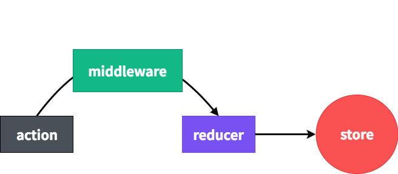

* content
{:toc}
### 리덕스란?
1. 사용률이 가장 높은 상태관리 라이브러리
2.  컴포넌트들의 상태 관련 로직들을 다른 파일들로 분리시켜서 더욱 효율적으로 관리 
3.  컴포넌트끼리 상태를 공유하게 될 때 여러 컴포넌트를 거치지 않고도 손쉽게 상태 값을 전달


### 용어정리
* 스토어 (Store)
리덕스에서는 한 애플리케이션 당 하나의 스토어를 만들게 됩니다. 스토어 안에는, 현재의 앱 상태와, 리듀서가 들어가있고, 추가적으로 몇가지 내장 함수들이 있습니다.

* 디스패치 (dispatch)
디스패치는 스토어의 내장함수 중 하나입니다. 디스패치는, 액션을 발생 시키는 것 이라고 이해하시면 됩니다. dispatch 라는 함수에는 액션을 파라미터로 전달합니다.. dispatch(action) 이런식으로 말이죠. 그렇게 호출을 하면, 스토어는 리듀서 함수를 실행시켜서 해당 액션을 처리하는 로직이 있다면 액션을 참고하여 새로운 상태를 만들어줍니다.

* 구독 (subscribe)
구독 또한 스토어의 내장함수 중 하나입니다. subscribe 함수는, 함수 형태의 값을 파라미터로 받아옵니다. subscribe 함수에 특정 함수를 전달해주면, 액션이 디스패치 되었을 때 마다 전달해준 함수가 호출됩니다.

* 리듀서 (Reducer)
리듀서는 변화를 일으키는 함수입니다. 리듀서는 두가지의 파라미터를 받아옵니다. 리듀서는, 현재의 상태와, 전달 받은 액션을 참고하여 새로운 상태를 만들어서 반환합니다.


``` js
 function reducer(state, action) {
  // 상태 업데이트 로직
  return alteredState;
}
```
* 액션 (Action)
상태에 어떠한 변화가 필요하게 될 땐, 우리는 액션이란 것을 발생시킵니다. 이는, 하나의 객체로 표현되는데요, 액션 객체는 다음과 같은 형식으로 이뤄져있습니다.
response

``` js
{
  type: "TOGGLE_VALUE"
}
```
액션 객체는 type 필드를 필수적으로 가지고 있어야하고 그 외의 값들은 개발자 마음대로 넣어줄 수 있습니다.
``` js
{
  type: "ADD_TODO",
  data: {
    id: 0,
    text: "리덕스 배우기"
  }
}
```
* 액션 생성함수 (Action Creator)
액션 생성함수는, 액션을 만드는 함수입니다. 단순히 파라미터를 받아와서 액션 객체 형태로 만들어주죠.

```js
function addTodo(data) {
  return {
    type: "ADD_TODO",
    data
  };
}

// 화살표 함수로도 만들 수 있습니다.
const changeInput = text => ({ 
  type: "CHANGE_INPUT",
  text
});
```
리덕스 3가지 규칙
1. 하나의 애플리케이션 안에는 하나의 스토어가 있습니다.
하나의 애플리케이션에선 단 한개의 스토어를 만들어서 사용합니다.  여러개의 스토어를 만들 수도 있습니다. 하지만 그렇게 하면, 개발 도구를 활용하지 못하게 됩니다.

2. 상태는 읽기전용 입니다.
리액트에서 state 를 업데이트 해야 할 때, setState 를 사용하고, 배열을 업데이트 해야 할 때는 배열 자체에 push 를 직접 하지 않고, concat 같은 함수를 사용하여 기존의 배열은 수정하지 않고 새로운 배열을 만들어서 교체하는 방식으로 업데이트를 합니다. 엄청 깊은 구조로 되어있는 객체를 업데이트를 할 때도 마찬가지로, 기존의 객체는 건드리지 않고 Object.assign 을 사용하거나 spread 연산자 (...) 를 사용하여 업데이트 하곤 하죠.

리덕스에서도 마찬가지입니다. 기존의 상태는 건들이지 않고 새로운 상태를 생성하여 업데이트 해주는 방식으로 해주면, 나중에 개발자 도구를 통해서 뒤로 돌릴 수도 있고 다시 앞으로 돌릴 수도 있습니다.

리덕스에서 불변성을 유지해야 하는 이유는 내부적으로 데이터가 변경 되는 것을 감지하기 위하여 shallow equality 검사를 하기 때문입니다. 이를 통하여 객체의 변화를 감지 할 때 객체의 깊숙한 안쪽까지 비교를 하는 것이 아니라 겉핥기 식으로 비교를 하여 좋은 성능을 유지할 수 있는 것이죠.

3. 변화를 일으키는 함수, 리듀서는 순수한 함수여야 합니다.
  - 리듀서 함수는 이전 상태와, 액션 객체를 파라미터로 받습니다.
  - 이전의 상태는 절대로 건들이지 않고, 변화를 일으킨 새로운 상태 객체를 만들어서 반환합니다.
  - 똑같은 파라미터로 호출된 리듀서 함수는 언제나 똑같은 결과값을 반환해야만 합니다.

3가지 사항을 주의해주세요. 동일한 인풋이라면 언제나 동일한 아웃풋이 있어야 합니다. 그런데 일부 로직들 중에서는 실행 할 때마다 다른 결과값이 나타날 수도 있죠. new Date() 를 사용한다던지.. 랜덤 숫자를 생성한다던지.. 혹은, 네트워크에 요청을 한다던지! 그러한 작업은 결코 순수하지 않은 작업이므로, 리듀서 함수의 바깥에서 처리해줘야 합니다. 


미들웨어는, 액션이 디스패치(dispatch) 되어서 리듀서에서 이를 처리하기전에 사전에 지정된 작업들을 설정합니다. 미들웨어를 액션과 리듀서 사이의 중간자 역활입니다.

미들웨어를 적용하지 않은 함수를 미들웨어를 적용하여 1초후 사용하는 비동기 작업으로 변경하면
```js
export const increaseAsync = () => ({ type: INCREASE_ASYNC });
export const decreaseAsync = () => ({ type: DECREASE_ASYNC });
```
1. redux-thunk (https://softwareinlife.atlassian.net/wiki/spaces/PD3/pages/132481049/Redux#1.-redux-thunk-%5BinlineCard%5D)
redux-thunk는 리덕스에서 비동기 작업을 처리 할 때 가장 많이 사용하는 미들웨어입니다.

액션 객체가 아닌 함수를 디스패치 할 수 있습니다.
```js
export const increaseAsync = () => dispatch => {
  setTimeout(() => dispatch(increase()), 1000);
};
export const decreaseAsync = () => dispatch => {
  setTimeout(() => dispatch(decrease()), 1000);
};
```
2. redux-saga (https://softwareinlife.atlassian.net/wiki/spaces/PD3/pages/132481049/Redux#2.-redux-saga-%5BinlineCard%5D)
- 액션을 모니터링하고 있다가, 특정 액션이 발생하면 이에 따라 특정 작업을 하는 방식
- 비동기 작업을 할 때 기존 요청을 취소 처리 할 수 있습니다
- 특정 액션이 발생했을 때 이에 따라 다른 액션이 디스패치되게 끔 하거나, 자바스크립트 코드를 실행 할 수 있습니다.
- 웹소켓을 사용하는 경우 Channel 이라는 기능을 사용하여 더욱 효율적으로 코드를 관리 할 수 있습니다
- API 요청이 실패했을 때 재 요청하는 작업을 할 수 있습니다.

### 리덕스 개발자 도구
우선 크롬 웹 스토어 에서 확장 프로그램을 설치 다음은 프로젝트에 redux-devtools-extension을 설치하세요.

```
$ yarn add redux-devtools-extension
```
그 다음에는 index.js를 다음과 같이 수정하시면 적용

```
import { composeWithDevTools } from 'redux-devtools-extension'; // 리덕스 개발자 도구

const store = createStore(rootReducer, composeWithDevTools()); // 스토어를 만듭니다.
// composeWithDevTools 를 사용하여 리덕스 개발자 도구 활성화
``` 
